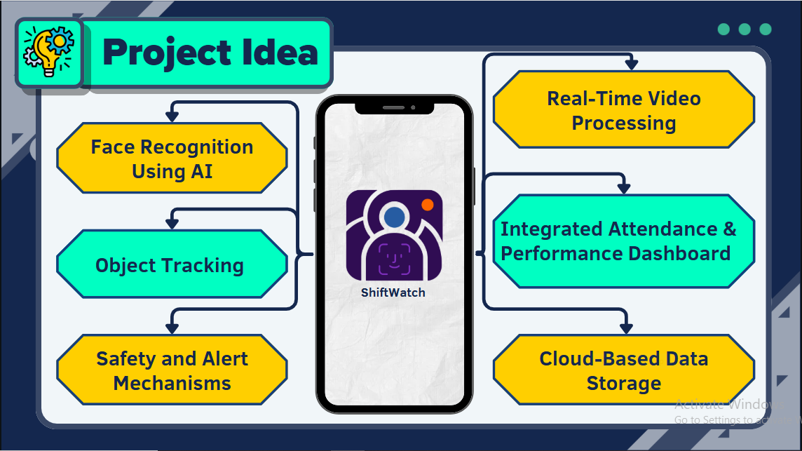
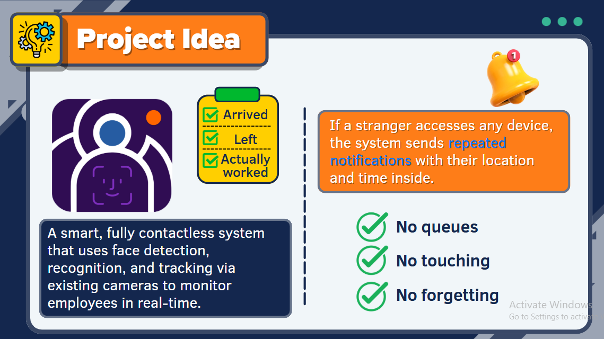
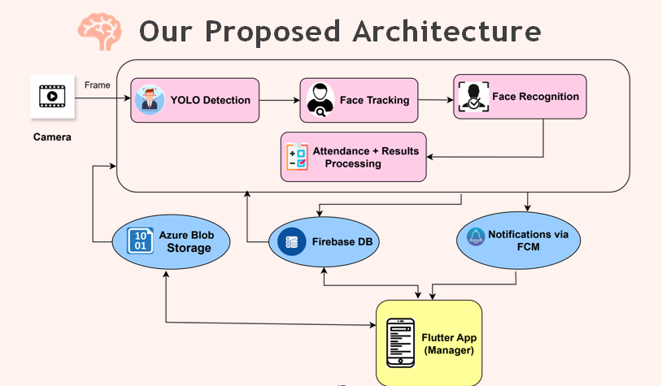
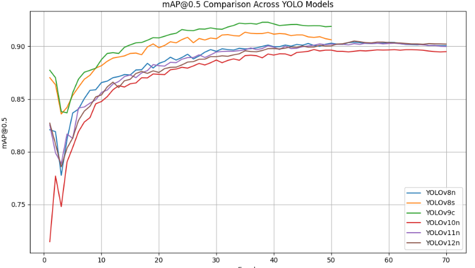
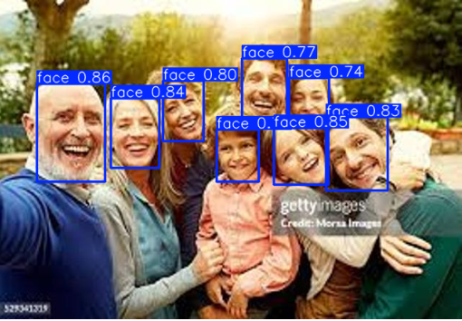
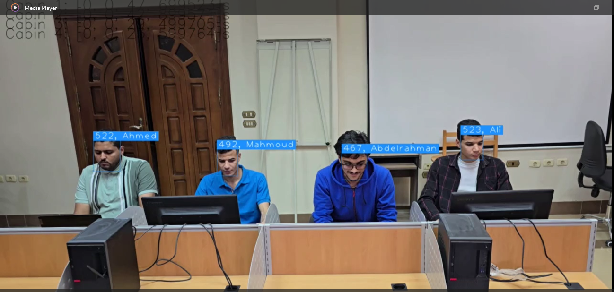
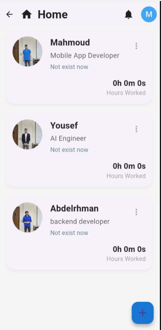
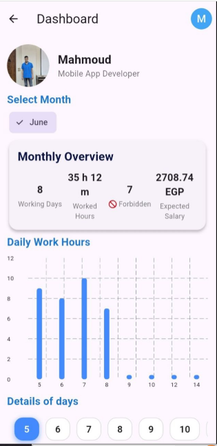
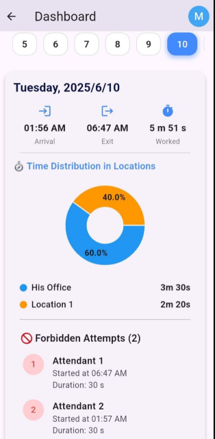
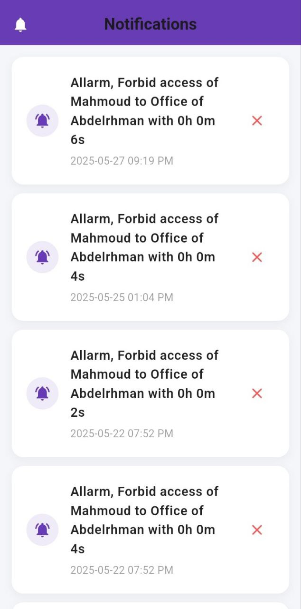

 
# ShiftWatch: Real-Time Workspace Employee Tracking & Monitoring System


<p align="center">
  
 <h2 align="center">Developed by Techno Team | Kafrelsheikh University</h2>
</p>


[]()
[]()
[]()
[]()
[]()
[]()

ShiftWatch is an **AI-powered real-time employee tracking and monitoring system** that combines:
- **YOLOv8** for face detection  
- **DeepSORT** for identity-preserving tracking  
- **Face recognition** for employee authentication  
- **Azure Blob Storage** + **Firebase Realtime DB** for cloud-based scalability  
- **Flutter mobile app** for real-time dashboards and insights  

> 🚀 **Impact:** ShiftWatch reduces manual attendance errors by 95%, increases workspace safety, and provides real-time insights for managers.
 
<p align="center">
  
  
</p>

---
## **🛠 Tech Stack**
- **Programming Languages:** Python, Dart  
- **AI Models:** YOLOv8, DeepSORT, Face Recognition  
- **Frameworks & Tools:** OpenCV, Ultralytics, TensorFlow  
- **Cloud & Storage:** Azure Blob Storage, Firebase Realtime DB  
- **Mobile App:** Flutter  
- **Database:** Firebase NoSQL  
---
## **📌 Features**
✅ Real-time employee detection & tracking  
✅ Face recognition for secure authentication  
✅ Cloud integration (Azure + Firebase)  
✅ Attendance & working hours calculation  
✅ Unauthorized access detection & alerts  
✅ Mobile dashboard for managers & HR  

---
## **🌍 Use Cases**
- **Corporate Offices** → Automate attendance & tracking
- **Factories** → Monitor employee shifts & unauthorized entries
- **Universities** → Track student & staff activity
- **Healthcare** → Secure sensitive workspaces
---
## **🧩 System Architecture**


---

## **📊 Results** 

### **⚡ YOLO Versions Comparison**




| Model      | Inference Time (sec/frame) | FPS   |
|-----------|-----------------------------|-------|
| YOLOv8n   | **0.0136**                 | **61.43** |
| YOLOv9t   | 0.0233                      | 38.21 |
| YOLOv10n  | 0.0143                      | 58.81 |
| YOLOv11n  | 0.0159                      | 53.47 |
| YOLOv12n  | 0.0214                      | 41.30 |

> **Selected Model:** YOLOv8n → Best trade-off between speed & accuracy.
---

### **📈 Final Model Performance**

| Metric           | Score |
|------------------|-------|
| **Precision**    | 0.899 |
| **Recall**       | 0.849 |
| **mAP@0.5**     | 0.903 |
| **mAP@0.5:0.95**| 0.611 |
| **FPS**         | 61.43 |

---

### **🎯 Tracking Methods Comparison**

| Tracking Method | Avg. Inference Time (sec/frame) | FPS   | Identity Consistency |
|---------------|---------------------------------|-------|----------------------|
| **DeepSORT** | 0.0287                          | 34.82 | ✅ Best balance |
| ByteTrack     | 0.0156                          | 54.24 | ❌ Lower accuracy |
| BoT-SORT      | 0.0385                          | 24.12 | ❌ Slower |

> **Selected Tracker:** **DeepSORT** → Better ID consistency + real-time speed.

---

### **🖼 Sample Outputs (AI Models)**
| Detection | Face Recognition | Final Results |
|-----------|------------------|---------------|
|  |  |  |

> **📂 For More Examples:** Check the [`results/`](results/) folder for additional detection, tracking, recognition, and dashboard outputs.

---

### **📱 Mobile App Dashboards**

The **ShiftWatch Flutter app** gives managers **real-time insights** into employee activities:
- Live attendance tracking  
- Total hours worked per employee  
- Unauthorized entry alerts  
- Daily, weekly, and monthly summaries 

| Attendance Summary | Dashboard (Part 1) | Dashboard (Part 2) | Unauthorized Alerts |
|--------------------|---------------------|---------------------|---------------------|
|  |  |  |  |


> **📂 For More App Screenshots:** Check the [`app_screens/`](results/results_in_app/) folder.

---

## **📱 Flutter App Source Code**
The Flutter-based mobile app that displays dashboards, employee analytics, and alerts is available in a separate repository.  

🔗 **[View Flutter App Repository](https://lnkd.in/dCmPassz)**


---


## **👩‍💻 Contributions**
- **Aya Motawea** → Team Leader, AI Engineer, System Architect
- **Rana Elzeiny** → Data Preprocessing & AI Engineer
- **Mahmoud AboGamihe** → Mobile App Developer
- **Abdelrahman Elmarakby** → Cloud Integration, Designer

---

## **🚀 How to Run the Demo**
```bash
# Clone the repo
git clone https://github.com/ayamotawea/shiftwatch.git
cd shiftwatch

# Install dependencies
pip install -r requirements.txt

# Run detection on a sample video
python demo/demo.py --source sample_video.mp4 --model models/best.pt
```
---
## **📖 Citation**
If you use or reference this work, please cite:  
*ShiftWatch: Real-Time Workspace Employee Tracking & Monitoring System (Graduation Project, Kafrelsheikh University, 2025).*

 --- 
## **📬 Contact**

👩‍💻 **Aya Motawea**  
📧 Email: yoyomotawaa@gmail.com 
🔗 LinkedIn: [linkedin.com/in/aya-motawea](https://www.linkedin.com/in/aya-motawea-661633251/)
🐙 GitHub: [github.com/ayamotawea](https://github.com/ayamotawea)
---
<p align="center">
  
</p>
<p align="center">
  Built with 💙 by Techno Team
</p>

