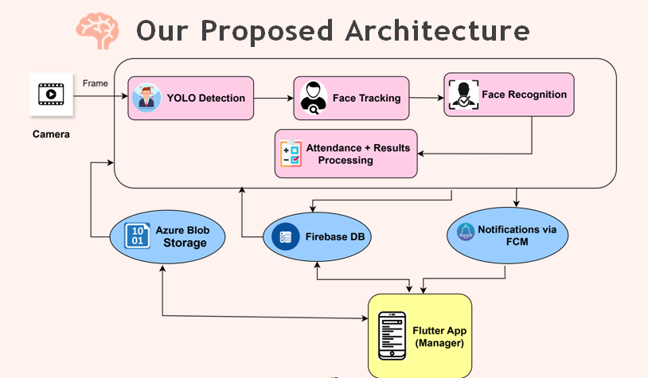

# ShiftWatch_graduation_poroject
# ShiftWatch: Real-Time Workspace Employee Tracking & Monitoring System

[](https://ejai.journals.ekb.eg)
[]()
[]()

ShiftWatch is an **AI-powered real-time employee tracking and monitoring system** that combines:
- **YOLOv8** for face detection  
- **DeepSORT** for identity-preserving tracking  
- **Face recognition** for employee authentication  
- **Azure Blob Storage** + **Firebase Realtime DB** for cloud-based scalability  
- **Flutter mobile app** for real-time dashboards and insights  


---

## **📌 Features**
✅ Real-time employee detection & tracking  
✅ Face recognition for secure authentication  
✅ Cloud integration (Azure + Firebase)  
✅ Attendance & working hours calculation  
✅ Unauthorized access detection & alerts  
✅ Mobile dashboard for managers & HR  

---

## **🧩 System Architecture**


---

## **📊 Results**
| Metric                | Score |
|----------------------|-------|
| **Precision**       | 0.899 |
| **Recall**          | 0.849 |
| **mAP@0.5**        | 0.903 |
| **mAP@0.5:0.95**   | 0.611 |
| **FPS**            | 34.8   |

### **Sample Outputs**
| Detection | Tracking | Dashboard |
|-----------|-----------|-----------|
|  |  |  |

---

## **📱 Mobile App**
We developed a **Flutter-based mobile app** to visualize attendance, dashboards, and employee activity.  
Check the repo here → [Flutter App Repository](https://github.com/your-colleague-repo-link)

---


## **👩‍💻 Contributions**
- **Aya Motawea** → Team Leader, AI Engineer, System Architect
- **Rana Elzeiny** → Data Preprocessing & AI Engineer
- **Mahmoud AboGamihe** → Mobile App Developer
- **Abdelrahman Elmarakby** → Cloud Integration, Designer

---

## **🚀 How to Run the Demo**
```bash
# Clone the repo
git clone https://github.com/ayamotawea/shiftwatch.git
cd shiftwatch

# Install dependencies
pip install -r requirements.txt

# Run detection on a sample video
python demo/demo.py --source sample_video.mp4 --model models/best.pt
