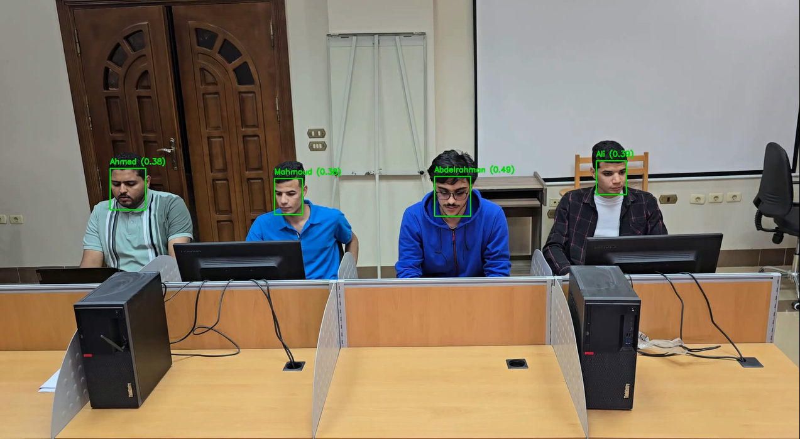

# ShiftWatch_graduation_poroject
# ShiftWatch: Real-Time Workspace Employee Tracking & Monitoring System

[]()
[]()
[]()

ShiftWatch is an **AI-powered real-time employee tracking and monitoring system** that combines:
- **YOLOv8** for face detection  
- **DeepSORT** for identity-preserving tracking  
- **Face recognition** for employee authentication  
- **Azure Blob Storage** + **Firebase Realtime DB** for cloud-based scalability  
- **Flutter mobile app** for real-time dashboards and insights  

<p align="center">
  
  
</p>

---

## **📌 Features**
✅ Real-time employee detection & tracking  
✅ Face recognition for secure authentication  
✅ Cloud integration (Azure + Firebase)  
✅ Attendance & working hours calculation  
✅ Unauthorized access detection & alerts  
✅ Mobile dashboard for managers & HR  

---

## **🧩 System Architecture**


---

## **📊 Results** 
### **⚡ YOLO Versions Comparison**


| Model      | Inference Time (sec/frame) | FPS   |
|-----------|-----------------------------|-------|
| YOLOv8n   | **0.0136**                 | **61.43** |
| YOLOv9t   | 0.0233                      | 38.21 |
| YOLOv10n  | 0.0143                      | 58.81 |
| YOLOv11n  | 0.0159                      | 53.47 |
| YOLOv12n  | 0.0214                      | 41.30 |

> **Selected Model:** YOLOv8n → Best trade-off between speed & accuracy.


### **🎯 Tracking Methods Comparison**

| Tracking Method | Avg. Inference Time (sec/frame) | FPS   | Identity Consistency |
|---------------|---------------------------------|-------|----------------------|
| **DeepSORT** | 0.0287                          | 34.82 | ✅ Best balance |
| ByteTrack     | 0.0156                          | 54.24 | ❌ Lower accuracy |
| BoT-SORT      | 0.0385                          | 24.12 | ❌ Slower |

> **Selected Tracker:** **DeepSORT** → Better ID consistency + real-time speed.


### **Sample Outputs**
| Detection | Face Recognition | Final Results |
|-----------|------------------|---------------|
|  |  |  |


---

## **📱 Mobile App**
We developed a **Flutter-based mobile app** to visualize attendance, dashboards, and employee activity.  
Check the repo here → [Flutter App Repository](https://lnkd.in/dCmPassz)

---


## **👩‍💻 Contributions**
- **Aya Motawea** → Team Leader, AI Engineer, System Architect
- **Rana Elzeiny** → Data Preprocessing & AI Engineer
- **Mahmoud AboGamihe** → Mobile App Developer
- **Abdelrahman Elmarakby** → Cloud Integration, Designer

---

## **🚀 How to Run the Demo**
```bash
# Clone the repo
git clone https://github.com/ayamotawea/shiftwatch.git
cd shiftwatch

# Install dependencies
pip install -r requirements.txt

# Run detection on a sample video
python demo/demo.py --source sample_video.mp4 --model models/best.pt
